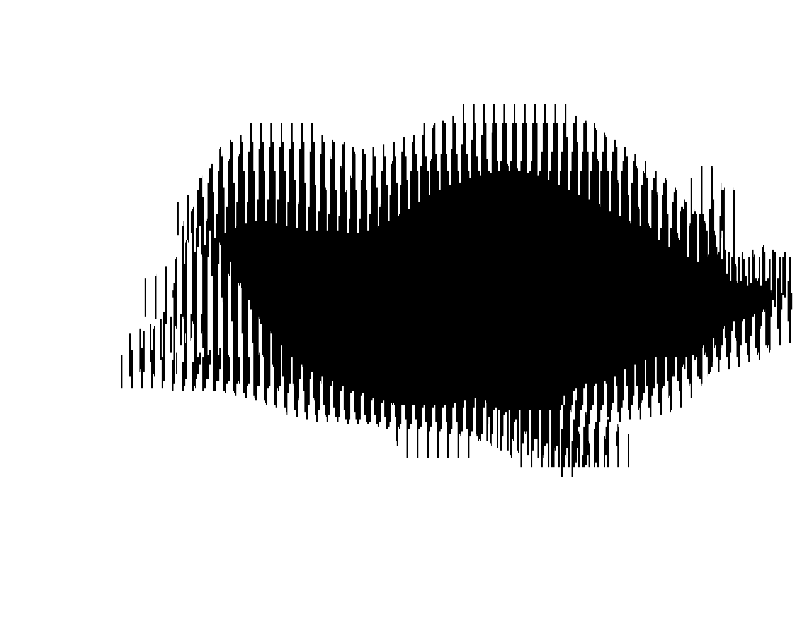
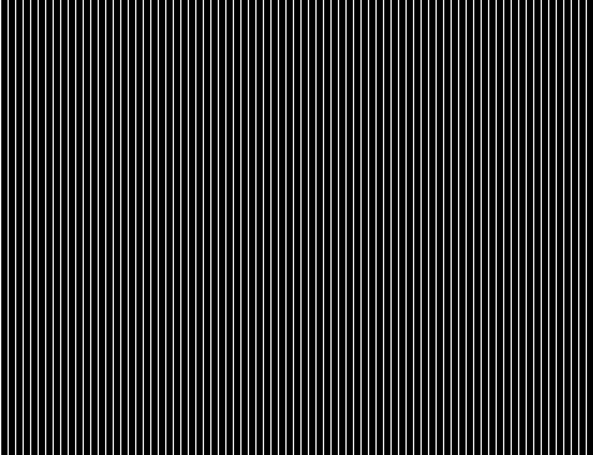
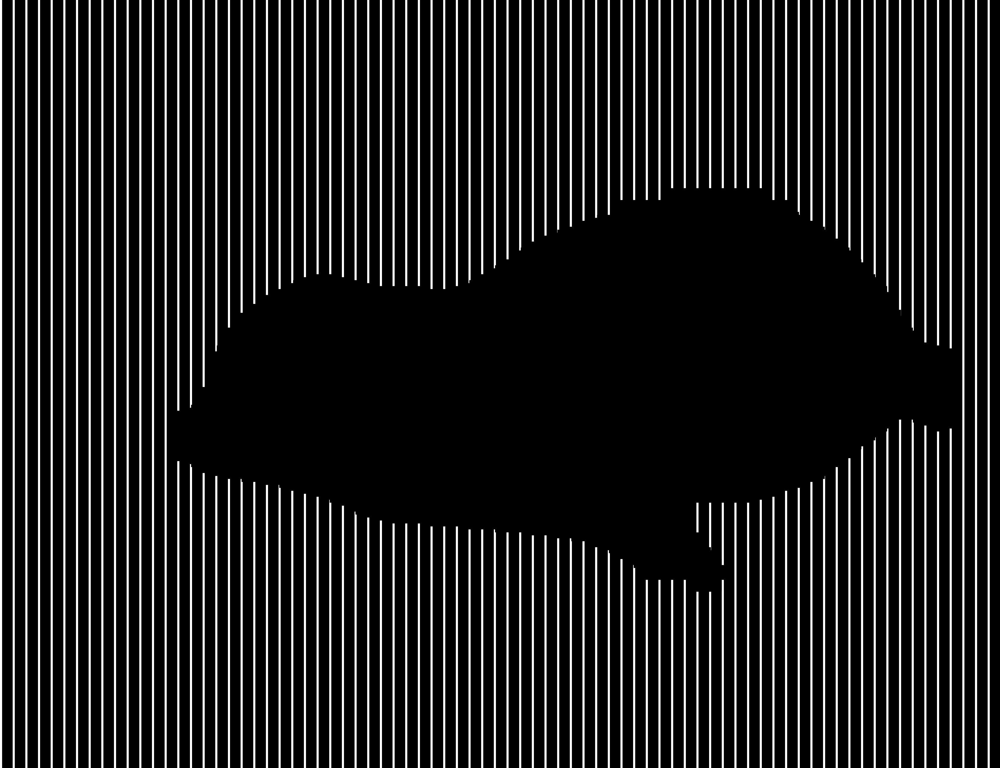

# Scanimation

Scanimation is an optical illusion technique where multiple images are interlaced into a single print and a striped barrier (with opening slits) is placed on top.  
When the barrier is moved across the interlaced image, the slits reveal one frame at a time, creating the illusion of motion.  

<p align="center">
  
  <span style="font-size: 2em; margin: 0 10px;">+</span>
  
  <span style="font-size: 2em; margin: 0 10px;">=</span>
  
</p>


This repository provides Python tools to generate scanimation barriers, interlace images, preview the animation digitally, and design lamp templates that you could use to make a lamp to view your scanimation through.

Python utilities to create and preview scanimation art:
- `create_scanimation_barrier` (SVG/PDF/PNG with transparent slits)
- `interlace_images` (pixel-accurate interlacing)
- `view_scanimation` (animated preview → GIF/MOV)
- `create_lamp_template` (circle/square/heart templates with ticks/dots)
- `identify_objects`, `monocolorize_images`, `resize_images` (prepares your images to be interlaced)

## Install

Clone and install dependencies:

```bash
git clone https://github.com/smedor/scanimation.git
cd scanimation
pip install -r requirements.txt
```

## Quick Start: Scanimate

Set parameters and provide video/image paths to obtain the scanimation barrier, interlaced image, and preview the animation:

```python
from scanimation.utils import count_images, calculate_ideal_fit, measurements_to_px
from scanimation.process import identify_objects, monocolorize_images, resize_images
from scanimation.barrier import create_scanimation_barrier
from scanimation.interlace import interlace_images
from scanimation.view import view_scanimation

images_path = "examples/images"
output_path = "output"

# Step 1: Process images
identified = identify_objects(images_path, objects_to_detect=["seal"])
mono = monocolorize_images(identified, color="black", invert=False)
resized = resize_images(mono, image_width=11, image_height=8.5, units="in", dpi=300)

# Step 2: Geometry
num_images = count_images(resized)
iw, ih, bw, sw = calculate_ideal_fit(resized, image_width=11, image_height=8.5,
                                     image_units="in", barrier_width=3.0, slit_width=None,
                                     barrier_units="mm", num_images=num_images)
W_px, H_px, b_px, s_px = measurements_to_px(iw, ih, bw, sw, "in", "mm", num_images=num_images)

# Step 3: Barrier + Interlace
create_scanimation_barrier(output_path, bw, sw, iw, ih, "in", "mm", W_px, H_px, b_px, s_px)
interlace_images(resized, output_path, W_px, H_px, b_px, s_px)

# Step 4: Preview
view_scanimation(output_path, W_px, H_px, b_px, s_px, fps=12, cycles=2)
```

## Quick Start: Create Lamp Template

If you would like to create a lamp for your interlaced image, create a template using the corresponding barrier geometry:

```python
from scanimation.lamp_template import create_lamp_template

# Parameters (these should have the same measurements as your barrier and interlaced image)
barrier_width = barrier_width
slit_width = slit_width
barrier_units = barrier_units
perimeter_distance = image_width
perimeter_units = image_units
shape = "circle"
output_path = output_path
svg_out="lamp_template.svg",
pdf_out="lamp_template.pdf",
print_specs = True,
extend_lines = True

# Create template (SVG + PDF)
svg_out, pdf_out = create_lamp_template(
    barrier_width=barrier_width,
    slit_width=slit_width,
    perimeter_distance=perimeter_distance,
    barrier_units=barrier_units,
    perimeter_units=perimeter_units,
    shape=shape,
    output_path=output_path,
    svg_out="lamp_template.svg",
    pdf_out="lamp_template.pdf",
    print_specs=True,
    extend_lines=True  # draw guide lines inward/outward + red center dot
)

print("Lamp template saved to:", svg_out, pdf_out)
```

## Documentation

	•	barrier.py → generate scanimation barriers
	•	process.py → object detection, monocolorization, resizing
	•	interlace.py → build interlaced images
	•	view.py → preview animations as GIF/MOV
	•	lamp_template.py → create lamp templates

See examples/scanimate.ipynb for a full walkthrough.


## License

MIT
